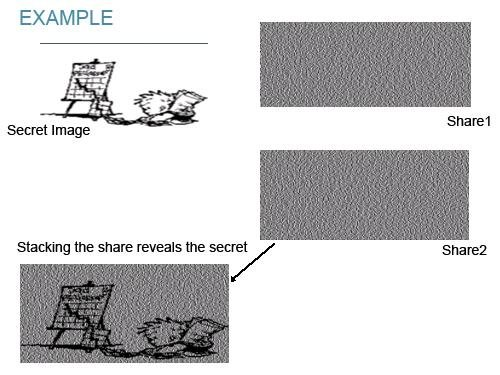

# Cryptography 
Simple projects for cryptography classes

## Block Cipher
In cryptography, a block cipher mode of operation is an algorithm that uses a block cipher to provide information security such as confidentiality or authenticity. A block cipher by itself is only suitable for the secure cryptographic transformation (encryption or decryption) of one fixed-length group of bits called a block. A mode of operation describes how to repeatedly apply a cipher's single-block operation to securely transform amounts of data larger than a block.  
The earliest modes of operation are ECB, CBC, OFB, and CFB.

## Number Generator

The Blum–Blum–Shub (BBS) pseudorandom bit generator is one of the most efficient pseudorandom number generators known that is provably secure under the assumption that factoring large composites is intractable (see integerfactoring). The generator makes use of modulararithmetic. 

Sources: [Wikipedia](https://en.wikipedia.org/wiki/Blum_Blum_Shub)
[SpringerLink](https://link.springer.com/referenceworkentry/10.1007/0-387-23483-7_37)

## Visual Cryptography
Visual cryptography is a cryptographic technique which allows visual information (pictures, text, etc.) to be encrypted in such a way that the decrypted information appears as a visual image.

Sources:
[Wikipedia](https://en.wikipedia.org/wiki/Visual_cryptography) 
[ResearchGate](https://www.researchgate.net/figure/Example-of-visual-cryptography_fig2_300715656)
